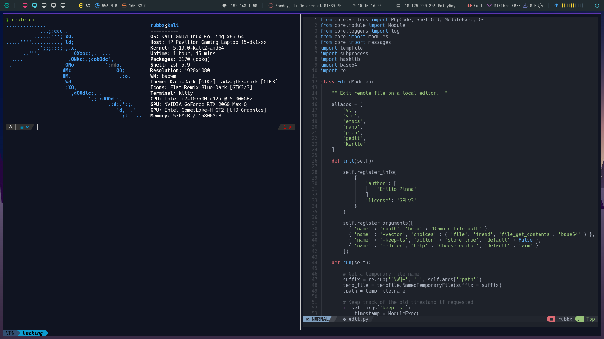

# Preview
<p align="center">
  
</p>

This repo contains a simple scripts to install and configure a very cool desktop enviroment without need to know how to create or configure shell scripts.

## Used programs

This program uses different apps and repositories to maximize the user experience.

## Fonts

- Isovaka Nerd Font
- Hack Nerd Font
- Feather font.

# Instalation

### 1. Clone this repository

````bash
git clone https://github.com/ThunderstrikeES/bspwm-dotfiles
```

### 2. Install the enviroment `./auto-bspwm.sh`

```bash
cd bspwm-dotfiles
chmod +x auto-bspwm.sh
./auto-bspwm.sh
./setup.sh
```
```text
